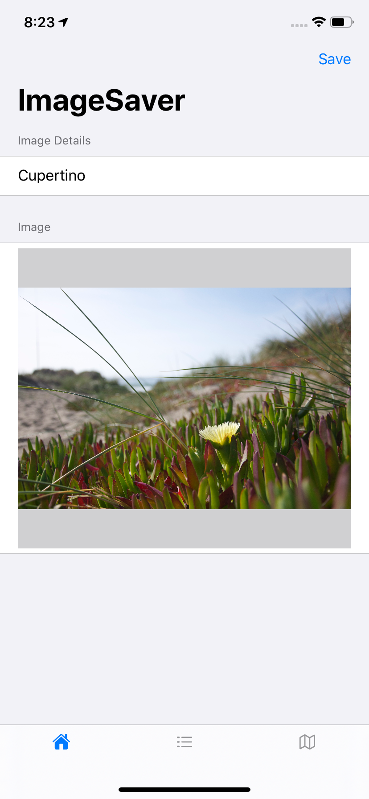

# Image-Saver

This app is a simple a app which asks user to upload an Image and saves the image in the document directory of app and also shows the location of the image on map using MapKit

Home Screen |        Saved Images   | MapView
:-------------------------:|:-------------------------:|
| | 

